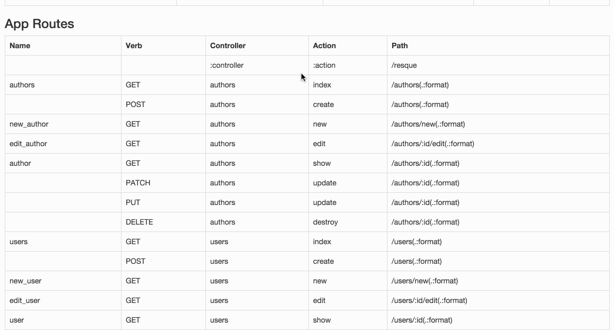

## Passages


## Purpose

This Rails Engine adds the ability to search over different attributes of Ruby on Rails routes within an application.

For example, an internal (or very permissive external) API can now expose a single page that will answer simple questions like: *"What was the HTTP verb for the `/users/clear_password` route?"* or *"Does a v2 or v3 version for this route exist?"*.

## Demo



## Install

In your `Gemfile`

```ruby
source 'https://rubygems.org'
gem 'passages'
```

`bundle install`

By default, the `Passages` Engine must be mounted in your `routes.rb` file.

Example:

*routes.rb*

```ruby
Rails.application.routes.draw do
  mount Passages::Engine, at: '/passages'
end
```

*Alternatively*, an initializer can be created that will allow the `Passages` Engine to mount itself.

Create a new file: `initializers/passages.rb` and add the following:

```ruby
Passages.configure do |config|
  config.automount = true
end
```

With the Engine mounted at `/passages`, the rendered page will display a search box and list of all known routes within the application.

## Authorization

Since there are no environment dependent checks, the `/passages` page uses configurable http basic authentication.

To set a `username` and `password` in the `Passages` Engine, add an `ENV` variable for each value.

`ENV['passages_username']` should be the desired `username` and `ENV['passages_password']` should be the desired `password`

By default these values are:

username: **username**

password: **password**

`ENV` variables can prefix a Ruby server command from the command line interface, set with a helper `.ENV` file for systems like `foreman` or set through a web interface on platforms like `heroku`.

## Contributing

Please feel free to fork and contribute your own changes to the Passages project. Single commits are preferred with a description of why the contribution is useful.
